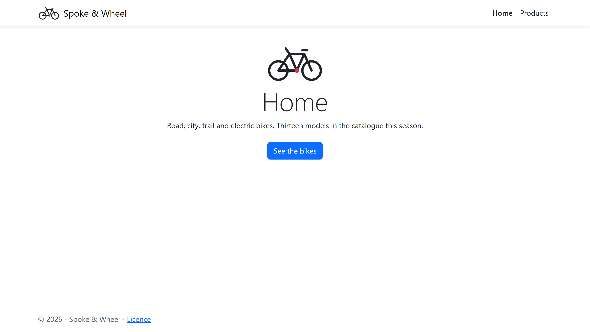
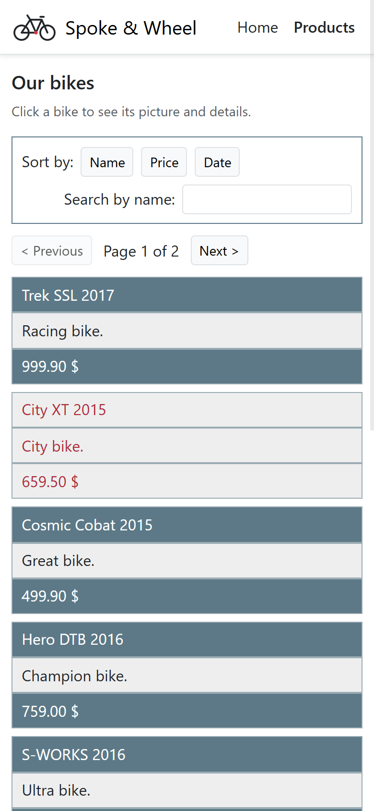

# spoke-and-wheel-storefront

[](https://github.com/Arthure-code/spoke-and-wheel-storefront/actions/workflows/build.yml)
[](https://sonarcloud.io/summary/new_code?id=Arthure-code_spoke-and-wheel-storefront)
[](https://sonarcloud.io/summary/new_code?id=Arthure-code_spoke-and-wheel-storefront)
[](https://sonarcloud.io/summary/new_code?id=Arthure-code_spoke-and-wheel-storefront)
[](https://sonarcloud.io/summary/new_code?id=Arthure-code_spoke-and-wheel-storefront)
[](https://sonarcloud.io/summary/new_code?id=Arthure-code_spoke-and-wheel-storefront)
[](https://sonarcloud.io/summary/new_code?id=Arthure-code_spoke-and-wheel-storefront)
[](https://sonarcloud.io/summary/new_code?id=Arthure-code_spoke-and-wheel-storefront)

The bike shop as a small multi-page application: a home page, a catalogue
page and one page per bike, switched by Vue Router without reloading. The
catalogue comes from a service that fetches it when the page is mounted;
the list searches, sorts and pages it ten bikes at a time, and clicking a
bike opens its own page, which fetches that bike by its id.

Vue 3 with `<script setup>`, Vue Router, built by Vite, styled with
Bootstrap. Three views, two components, one service, no store.

## Screenshots






## How it works

**Three routes, three views.** `router/index.js` maps `/` to `HomeView`,
`/products` to `ProductsView` and `/products/:id` to `ProductView`, the
last two loaded on first visit. `App.vue` holds the menu, two
`<RouterLink>`s, and the `<RouterView>` where the current view renders. The
history mode gives clean URLs; the entry of the menu that matches the page
is written in bold through the `router-link-active` class.

**One service for every call.** `services/ProductService.js` is the only
file that calls `fetch`. `getProducts()` returns the catalogue,
`getProduct(id)` one bike or `null`, and both throw with the status when
the answer is not 2xx. Today the catalogue is `public/api/products.json`,
served with the site; `API_URL` is the one line to change for a live API.

**Fetch on mount, then render.** Each view asks the service in `onMounted`,
shows a loading line until the answer arrives, the error if there is one,
and the component otherwise. `ProductView` gets the id from the route as a
prop (`props: true` on the route) and asks for that bike alone.

**The list is the same component as before, ten a page.** `ProductList`
still filters, sorts and pages through its computed chain; the view passes
`perPage` 10. Its `select` event now pushes the product's route instead of
opening a panel, so the detail has an address of its own that can be
bookmarked or reloaded.

**The pictures are linked, not stored.** Each product carries an
`imageUrl` pointing at a public photo on
[Unsplash](https://unsplash.com/license); no image file lives in the
repository.

## Running it

```bash
npm install
npm run dev
```

`npm run build` writes the static site to `dist/`. Because the router uses
the history mode, the server that hosts `dist/` must send `index.html` for
any path it does not know (`npm run preview` does).

## Tests

```bash
npm test
```

Thirty tests, set up the way the [Vue guide](https://vuejs.org/guide/scaling-up/testing.html)
describes: Vitest configured in `vite.config.js` with `globals: true` and a
`happy-dom` environment, components mounted with Vue Test Utils, elements
found by `data-testid`. The service is tested against a stubbed `fetch`;
the views and the app against a stubbed service and a real router on a
memory history, one instance per test, as the Vue Test Utils guide on Vue
Router asks. `npm run coverage` adds the coverage report, which the
workflow hands to SonarCloud.

## Stack

Vue 3.5 with `<script setup>`, Vue Router 5, Vite 8, Bootstrap 5.3 for the
page frame and scoped CSS for the list. Vitest, Vue Test Utils and
happy-dom for the tests.

## Résumé

La boutique de vélos en petite application à plusieurs pages : accueil,
catalogue et une page par vélo, servies par Vue Router sans rechargement.
Le catalogue vient d'un service qui le charge au montage de la vue
(`onMounted`) ; la liste le filtre, le trie et le pagine dix vélos à la
fois, et un clic sur un vélo ouvre sa page, qui redemande ce vélo par son
identifiant. Un seul fichier appelle `fetch`, `ProductService.js` ; le
catalogue est aujourd'hui un JSON servi avec le site, une constante à
changer pour une vraie API. Trente tests Vitest, écrits comme le guide Vue
le montre, avec un routeur réel en mémoire pour les vues.

## Licence

MIT. See [LICENSE](LICENSE).
